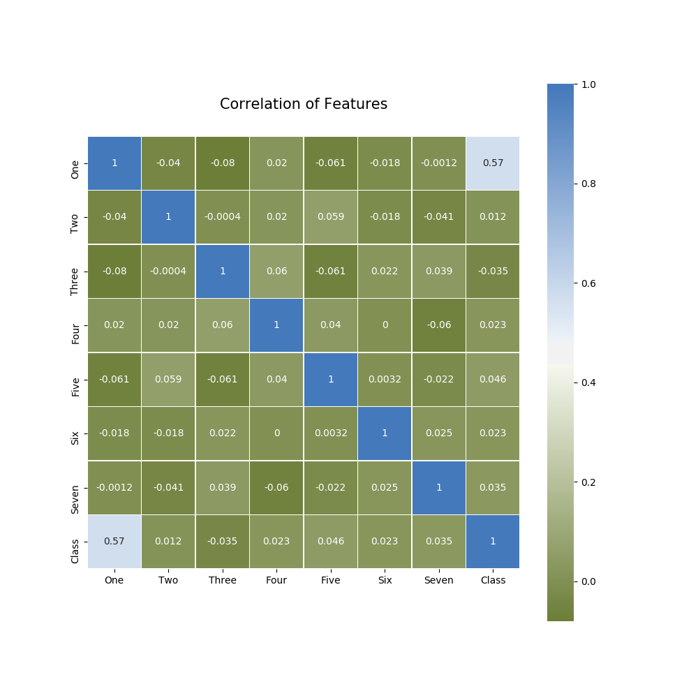

# Assignment 4 - TDT 4171 Artificial Intelligence Methods

#### By Henrik Høiness 18th of March 2019

##### Installation Prerequisites

* *Python >=3.5*
* *Scikit-learn*
* *Matplotlib*, *Seaborn*
* *Pandas*, *Numpy*

> This PDF along with a .zip folder with source code is this assignments deliverables.

#### Decision Tree

Below is the Decision tree that is being built with the `decision_tree_learning` method in `decision_tree.py`. It has an accuracy score of $0.93$ on the testing data provided.


```python
Decision tree:
 -> One
	1 -> 1
	2 -> Five
		1 -> Three
			1 -> Two
				1 -> 1
				2 -> 2
			2 -> Two
				1 -> 2
				2 -> 1
		2 -> Six
			1 -> Two
				1 -> Three
					1 -> 1
					2 -> 2
				2 -> Three
					1 -> 2
					2 -> 1
			2 -> Seven
				1 -> Three
					1 -> Two
						1 -> 1
						2 -> 2
					2 -> Two
						1 -> 2
						2 -> 1
				2 -> Two
					1 -> Three
						1 -> 1
						2 -> 2
					2 -> 2
Accuracy: 0.9285714285714286
```

> The variables/features are represented as words, i.e. '1' becomes 'One'.
> The code some places assumes binary classification, i.e. U = {1, 2}


Since the algorithm chooses the first attribute with maximum importance, which is an arbitrary choice, we could have gotten another decision tree if we were to choose in an another order when multiple maximum values.


#### What can you conclude about the results you have obtained?

I can, with $93\%$, conclude the class of the test data. This is good with only 100 rows of training data. It is hard to know which features that is important since their labels are only numbers. It is though possible to draw a correlation-map of the features to see if there is any correlation between the variables.



#### Which $Importance$ is better, and why?

The $Importance$ function based on information gain is stable and deterministic. It will therefore produce the same decision tree each time it is trained. The random $Importance$ method is random and will choose the attributes to split on randomly.

In this task I got, in most cases, best results with the importance based on information gain. But the method involving only randomness can in other cases be the preferred choice, since it can be beneficial with some randomness in cases where decision trees are used. 

  
#### Do you get the same result if you run the random $Importance$ several times?

The decision tree and accuracy score differs from each execution. It involves randomness and scores the attributes randomly. This can in some cases result in better or worse splits than in the splits based on information gain.


#### What happens when you run the decision tree learning algorithm based on $Information\ Gain$ several times?

If the decision tree is trained with an $Importance$ function based on information gain, the decision tree will be reproduced each execution, which will give the same accuracy and predictions.