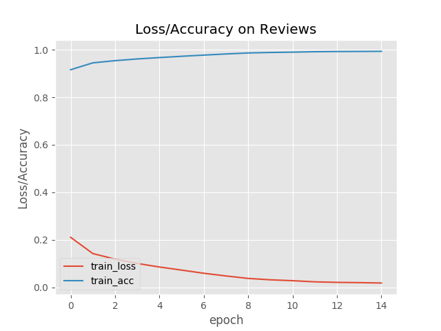

# Assignment 5 - Artificial Intelligence 
#### By Henrik Høiness - 26th of March 2019


#### Preprocessing

I preprocess the `sklearn-data.pickle` data by removing all special characters, and remove the english stopwords provided by NLTK, a natural language toolkit, in the vectorizing.

## BernioulliNB - Scikit-learn

##### HashingVectorizer
Used the vectorizer-class `HashingVectorizer` from `sklearn.feature_extraction.text`.


*Hyperparameters:*

* `norm`: `l1`
* `n_features`: `2**28`
* `ngram_range`: `(1,3)`,
* `stop_words`: `nltk.corpus.stopwords.words('english')`
* `binary`: `False`
* `alternate_sign`: `False`

##### Classifier

`classifier_nb = BernoulliNB(alpha=1.0e-10)`

##### Accuracy

**Accuracy of Naive Bayes classifier**: $0.908$


## DecisionTreeClassifier - Scikit-learn

##### Hashing vectorizer
Used the vectorizer-class `HashingVectorizer` from `sklearn.feature_extraction.text`.

*Hyperparameters:*

* `norm`: `l1`
* `n_features`: `2**18`
* `stop_words`: `nltk.corpus.stopwords.words('english')`
* `binary`: `False`
* `alternate_sign`: `False`

> Did not use n-grams here because of the complexity in the decision tree it brought along.
 
##### Classifier

`classifier_dt = DecisionTreeClassifier()`

##### Accuracy

**Accuracy of decision tree classifier is**: $0.8654$


## LSTM Network with Keras

Final network used in report: `LSTM_ReviewClf_2019-03-26 13/32/34.471471.h5`

**Network-structure:**


``` python
def build_model():
    model = Sequential()
    model.add(Embedding(vocab_size, output_dim=256))
    model.add(LSTM(256))
    model.add(Dense(2))
    model.add(Activation("softmax"))

    model.compile(loss='binary_crossentropy', optimizer="adam", metrics=['accuracy'])
    return model
```

Comments:

* Trained with 15 epochs with a batch size of 128.

* Embedding the input of word-indices, to the relations of the inputs in another dimension.

* A Long-Short-Term-Memory layer of 256 nodes, did also perform well with 128 nodes.

* A dense/fully connected layer with 2 output nodes, with `softmax` as activation function. This activation function is supposed to work well in output layers for classification.

* Using binary cross-entropy as loss-function as it is good for binary classification, and is adjusting weights to according to cross-entropy loss. 


##### Plot of the network's training history 



**Accuracy on training data**: $0.9579$

The network performs well on the training data, and produces an accuracy of approx. $96 \%$.


#### What  is  the  reason  for  the  large  improvement  in  accuracy  from  the Naive Bayes and Decision Tree models to the LSTM? Give the most important reasons

They are all classifiers, and is used to classify data given a set of features. 

The Naive Bayes model consume pre-processed text (e.g. vectorized, bag of words, tf-idf). The classifier assumes the features to be independent, and as long this assumption holds it performs well. In natural language the features/words in reviews are indeed dependent, and might be the reason why the model performs as it does.

Decision trees are easy to interpret, and will perform less complex computations for choosing the most important features than an NN. It becomes also very complex when the number of features increases.

Long Short Term Memory network, is a recurrent NN, and can learn tasks that require memories of events that happened thousands or even millions of discrete time steps earlier. Because of this such a network has the ability  to learn to recognize context-sensitive languages unlike previous models based on hidden Markov models (HMM) and similar concepts.

The LSTM network processes the data sequentially, keeping a "memory" of the previous data. Which is good for exploiting the correlation between words. 


